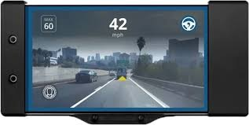
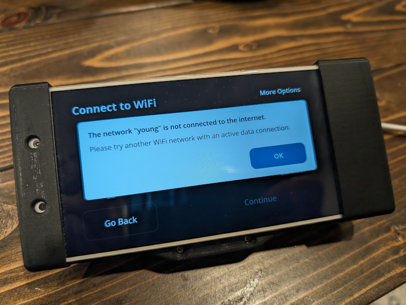

OpenPilot Comma2 revival
======

Well! You got your hands on the mighty Comma2, but need NEOS reinstalled?
I got you covered! Atleast, hopefully :D

Requirements
------
1. A Windows PC with Administrative rights
2. A (USB-A or USB-C) to USB-C cable
3. Atleast 5GB or more free diskspace
4. Internet connection (to download 3.5GB of the needed files) 
5. Comma 2 in Fastboot mode (holding `"Power + Volume -"` when plugging in USB-C cable)
6. Have ADB installed so you can see the Comma2 device in Fastboot mode (Open CMD and execute: `fastboot devices` )

Reflashing NEOS for Comma2
------
1. All requirements above are met
2. Download and extract this repository
3. In the repository folder open the `flashNEOS.bat` file
4. The flashing progress of NEOS will start for the Comma2 (This can take up to 5 minutes)

Working around the "The Network "YourSSID" is not connected to the internet." issue.
------

Comma AI have shutdown the servers to make the Comma2 ready for use.
The perfect guide of [JYoung8607](https://github.com/jyoung8607/neos-manual-install) has a detailed instruction how to get around this.

Troubleshooting
------
- Device does not show with `fastboot devices`
    1. Comma2 is not in Fastboot Mode (holding `Power + Volume -` when plugging in USB-C cable)
    2. Within Device Manager (`Windows + X`), Android is shown as "Other Device" instead of "Android Device > Android Composite ADB Interface" you can fix this by running Fawaz Ahmed's Installer: https://github.com/fawazahmed0/Latest-adb-fastboot-installer-for-windows

Support
------
If this guide did help you, please let me know:
[BuyMeACoffee](https://buymeacoffee.com/tnijland3)